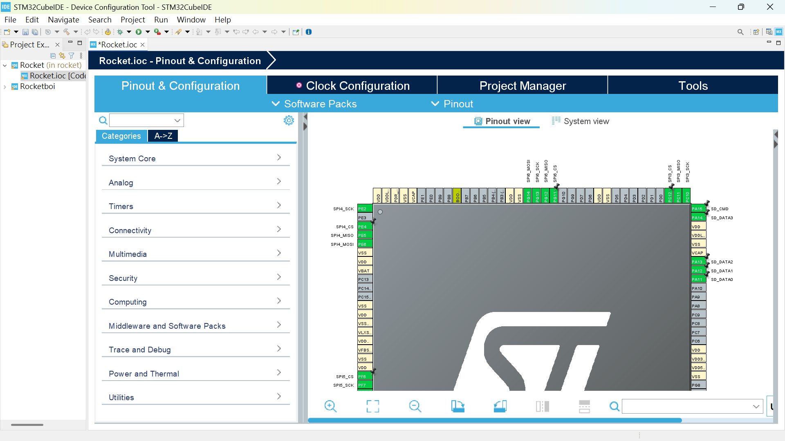

# COMPONENT SPECS

## MICROCONTROLLER SPECS
Name: STM32H755XIH6

[Datasheet](https://www.st.com/resource/en/datasheet/stm32h755bi.pdf)
[Info](https://www.st.com/resource/en/application_note/an4938-getting-started-with-stm32h74xig-and-stm32h75xig-mcu-hardware-development-stmicroelectronics.pdf)

Voltage required: 3.3V

Total source current: 620mA

Total pin output current: 140mA

Clock Frequency: 64MHz

Communication method: SPI, SDIO

## BAROMETER SPECS
Name: MS5611

[Datasheet](https://www.te.com/commerce/DocumentDelivery/DDEController?Action=showdoc&DocId=Data+Sheet%7FMS5611-01BA03%7FB3%7Fpdf%7FEnglish%7FENG_DS_MS5611-01BA03_B3.pdf%7FCAT-BLPS0036)

Voltage required: 3.3V

Current rating: 1.4mA

Communication method: SPI, using channel 3
## IMU SPECS
Name: Adafruit ISM330DHCX

[Datasheet](https://www.st.com/resource/en/datasheet/ism330dhcx.pdf)

Voltage rating: Typical 1.8V, max rating 3.6V

Current consumption: 1.5mA

Communication method: SPI, using channels 2 & 5

## ON BOARD FLASH
Name: SST25VF080B

[Datasheet](http://ww1.microchip.com/downloads/en/DeviceDoc/20005045C.pdf)

Voltage: 2.7V ~ 3.6V

Current rating: 10mA max

Data Size: 1MB

Communication method: SPI, using channels 4
## SD CARD SPECS
Name: Adafruit Micro SD SPI or SDIO Card

[Datasheet](https://cdn-learn.adafruit.com/downloads/pdf/adafruit-microsd-spi-sdio.pdf)

Voltage: 3.3V

Communication method: SDIO *Pin not assigned yet
## GPS SPECS
Name: NEO-M8M

[Datasheet](https://content.u-blox.com/sites/default/files/products/documents/NEO-M8_ProductSummary_UBX-16000345.pdf)

## RADIO SPECS
Name: Adafruit RFM95W LoRa Radio

[Info](https://www.adafruit.com/product/3072)

Bit rate: 300 kbps

current consumption: 10.3mA

Communication method: SPI, using channel 6.
## SERVO SPECS
Name: DS5160

[Datasheet](https://m.media-amazon.com/images/I/81EFGw8qkhL.pdf)

Voltage rating: 8V

Current consumption: 6.2A

Note: requires PWM to control it
## BATTERY SPECS 1
Name: GRP402049-1C-3.8V-450mAh

[Datasheet](https://drive.google.com/file/d/1r1or5fdFM2Az3-8GFAZaegb-1_r7XS7f/view)

Note: Selected for being Lipo, which lab comes with Lipo charger & resistence to vibration
## BATTERY SPECS 2
Name: GRP403530-1C-4.35V-360mAh with PCM

[Datasheet](https://drive.google.com/file/d/1zsI7abhJyncET1ZgONkUpj0koPwNgk_m/view)

Note: For powering the Servo, which requires 8V, put 2 of them in series to create 8V. Selected for being Lipo, which lab comes with Lipo charger & resistence to vibration
## LDR SPECS
Undecided
## VOLTAGE RECTIFIER 1
Name: HT7533-1

[Datasheet](http://www.e-ele.net/DataSheet/HT75XX-1.pdf)

 Linear regulator for 3.3V, creating the needed voltage for most components
## VOLTAGE RECTIFIER 2
Name: UA78L08

[Datasheet](https://www.ti.com/lit/ds/symlink/ua78l.pdf?ts=1743278162471&ref_url=https%253A%252F%252Fwww.google.com%252F)

 Linear regulator for 3.3V, creating the needed voltage for the Servo
# PIN CONFIGURATION
## SPI Device Pin Assignments

| **SPI**  | **Device**     | **MOSI** | **MISO** | **CLK** | **CS**  |
|----------|--------------|---------|---------|------|------|
| **SPI1** | GPS         | PA7     | PA6     | PA5  | PA4    |
| **SPI2** | IMU2        | PC1     | PC2_C   | PB10 | PC3_C    |
| **SPI3** | Barometer   | PB2     | PC11    | PC10 | PC12  |
| **SPI4** | Memory Flash | PE6     | PE5     | PE2  | PE4    |
| **SPI5** | IMU1        | PF9     | PF8     | PF7  | PF6    |
| **SPI6** | Radio       | PG14    | PG12    | PG13 | PG11    |
##

